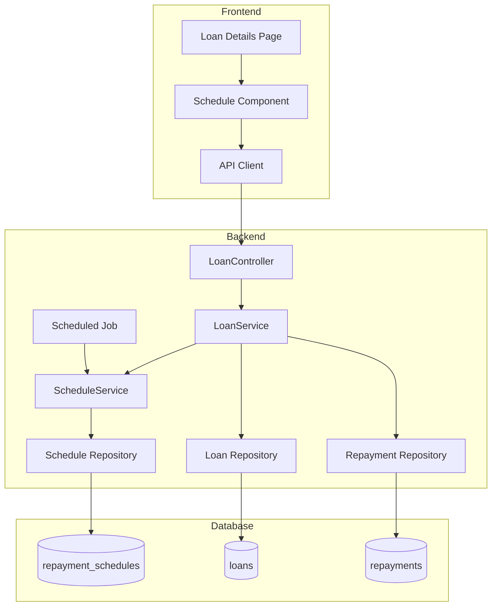
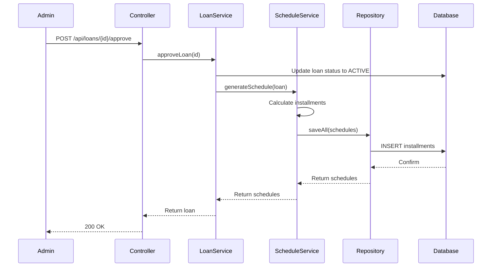
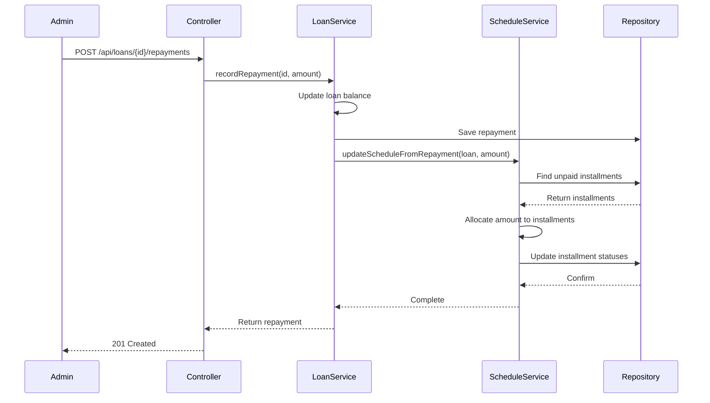

# Design Document: Loan Repayment Schedule

## Overview

The Loan Repayment Schedule feature extends the Digital Ikimina platform to automatically generate, track, and display installment-by-installment repayment schedules for approved loans. This design introduces a new `RepaymentSchedule` entity to store individual installments, a `ScheduleService` component to handle schedule generation and updates, new REST API endpoints for schedule operations, and frontend components to display schedule information in loan detail views.

The system automatically generates schedules when loans transition to ACTIVE status, updates installment statuses as repayments are recorded, marks overdue installments via scheduled jobs, and provides both detailed schedule views and summary statistics for quick assessment.

### Key Design Goals

1. **Automatic Schedule Generation**: Create complete installment schedules when loans are approved without manual intervention
2. **Real-time Status Updates**: Reflect payment progress by updating installment statuses as repayments are recorded
3. **Overdue Detection**: Automatically identify and mark installments that pass their due date without payment
4. **Data Consistency**: Maintain referential integrity between loans, schedules, and repayments
5. **Performance**: Efficiently query and display schedules without impacting existing loan operations
6. **Backward Compatibility**: Integrate seamlessly with existing loan approval and repayment workflows

## Architecture

### High-Level Architecture



### Component Responsibilities

**Backend Components:**

1. **ScheduleService**: Core business logic for schedule generation, status updates, and validation
2. **ScheduleRepository**: JPA repository for CRUD operations on installment records
3. **LoanService**: Enhanced to trigger schedule generation on approval and coordinate with ScheduleService for repayment processing
4. **LoanController**: New endpoints for schedule retrieval and regeneration
5. **ScheduledJobService**: Background job to mark overdue installments daily

**Frontend Components:**

1. **ScheduleTable**: Displays the complete repayment schedule with installment details
2. **ScheduleSummary**: Shows aggregated statistics (paid, pending, overdue counts)
3. **InstallmentStatusBadge**: Visual indicator for installment status
4. **Enhanced Loan Details Page**: Integrates schedule display into existing loan view

### Integration Points

1. **Loan Approval Flow**: `LoanService.approveLoan()` triggers `ScheduleService.generateSchedule()`
2. **Repayment Recording Flow**: `LoanService.recordRepayment()` triggers `ScheduleService.updateScheduleFromRepayment()`
3. **Scheduled Jobs**: Daily cron job calls `ScheduleService.markOverdueInstallments()`
4. **API Layer**: New endpoints in `LoanController` for frontend schedule operations

## Components and Interfaces

### Backend Components

#### 1. RepaymentSchedule Entity

```java
@Entity
@Table(
    name = "repayment_schedules",
    uniqueConstraints = @UniqueConstraint(columnNames = {"loan_id", "installment_number"}),
    indexes = @Index(name = "idx_loan_id", columnList = "loan_id")
)
public class RepaymentSchedule {
    @Id
    @GeneratedValue(strategy = GenerationType.IDENTITY)
    private Long id;

    @ManyToOne(fetch = FetchType.LAZY)
    @JoinColumn(name = "loan_id", nullable = false)
    private Loan loan;

    @Column(nullable = false)
    private Integer installmentNumber;

    @Column(nullable = false)
    private LocalDate dueDate;

    @Column(nullable = false, precision = 19, scale = 2)
    private BigDecimal installmentAmount;

    @Enumerated(EnumType.STRING)
    @Column(nullable = false)
    private InstallmentStatus status;

    @Column(nullable = false, precision = 19, scale = 2)
    private BigDecimal remainingBalance;

    // Constructors, getters, setters
}
```

**Fields:**
- `id`: Primary key
- `loan`: Reference to parent loan
- `installmentNumber`: Sequence number (1 to N)
- `dueDate`: When payment is due
- `installmentAmount`: Amount due for this installment
- `status`: Current status (PENDING, PAID, OVERDUE, PARTIALLY_PAID)
- `remainingBalance`: Loan balance after this installment is paid

#### 2. InstallmentStatus Enum

```java
public enum InstallmentStatus {
    PENDING,        // Not yet due or unpaid but not overdue
    PAID,           // Fully paid
    OVERDUE,        // Past due date without payment
    PARTIALLY_PAID  // Partial payment received
}
```

#### 3. ScheduleRepository Interface

```java
@Repository
public interface ScheduleRepository extends JpaRepository<RepaymentSchedule, Long> {
    List<RepaymentSchedule> findByLoanIdOrderByInstallmentNumberAsc(Long loanId);
    
    List<RepaymentSchedule> findByLoanIdAndStatusIn(Long loanId, List<InstallmentStatus> statuses);
    
    List<RepaymentSchedule> findByStatusAndDueDateBefore(InstallmentStatus status, LocalDate date);
    
    void deleteByLoanId(Long loanId);
    
    long countByLoanId(Long loanId);
    
    @Query("SELECT COUNT(r) FROM RepaymentSchedule r WHERE r.loan.id = :loanId AND r.status = :status")
    long countByLoanIdAndStatus(@Param("loanId") Long loanId, @Param("status") InstallmentStatus status);
}
```

#### 4. ScheduleService

```java
@Service
@Transactional
public class ScheduleService {
    private final ScheduleRepository scheduleRepository;
    private final LoanRepository loanRepository;
    
    // Generate complete schedule when loan is approved
    public List<RepaymentSchedule> generateSchedule(Loan loan);
    
    // Update installment statuses based on repayment
    public void updateScheduleFromRepayment(Loan loan, BigDecimal repaymentAmount);
    
    // Mark overdue installments (scheduled job)
    public int markOverdueInstallments();
    
    // Retrieve schedule for display
    public List<RepaymentSchedule> getScheduleByLoanId(Long loanId);
    
    // Get summary statistics
    public ScheduleSummary getScheduleSummary(Long loanId);
    
    // Delete and regenerate schedule
    public List<RepaymentSchedule> regenerateSchedule(Long loanId);
    
    // Validate schedule consistency
    public ValidationResult validateSchedule(Long loanId);
}
```

**Method Specifications:**

**`generateSchedule(Loan loan)`**
- Precondition: Loan must have ACTIVE status and approvalDate set
- Creates N installment records where N = loan.repaymentMonths
- Each installment: dueDate = approvalDate + installmentNumber months
- Each installment: amount = loan.monthlyInstallment
- Calculates remainingBalance descending from totalPayable
- Sets all status = PENDING
- Returns: List of created RepaymentSchedule entities
- Error handling: Logs error but doesn't throw to avoid blocking loan approval

**`updateScheduleFromRepayment(Loan loan, BigDecimal repaymentAmount)`**
- Precondition: Loan must exist and have schedule records
- Retrieves unpaid installments (PENDING, OVERDUE, PARTIALLY_PAID) ordered by dueDate ASC
- Allocates repayment amount to installments sequentially:
  - If amount >= installment amount: mark PAID, carry excess to next
  - If amount < installment amount: mark PARTIALLY_PAID
- Updates remainingBalance for affected installments
- Persists all changes

**`markOverdueInstallments()`**
- Finds all PENDING installments where dueDate < current date
- Updates status to OVERDUE
- Returns count of updated installments
- Called by scheduled job daily at midnight

#### 5. Enhanced LoanService

Modified methods:

```java
public Loan approveLoan(Long id) {
    Loan loan = findLoan(id);
    if (loan.getStatus() != LoanStatus.PENDING) {
        throw new IllegalArgumentException("Only pending loans can be approved");
    }
    loan.setStatus(LoanStatus.ACTIVE);
    loan.setApprovalDate(LocalDate.now());
    loan.setDueDate(LocalDate.now().plusMonths(loan.getRepaymentMonths()));
    
    Loan savedLoan = loanRepository.save(loan);
    
    // Generate repayment schedule
    try {
        scheduleService.generateSchedule(savedLoan);
    } catch (Exception e) {
        log.error("Failed to generate schedule for loan {}", savedLoan.getId(), e);
        // Continue - schedule can be regenerated later
    }
    
    return savedLoan;
}

public Repayment recordRepayment(Long loanId, RepaymentRequest request) {
    // Existing repayment logic...
    Repayment savedRepayment = repaymentRepository.save(repayment);
    
    // Update schedule
    try {
        scheduleService.updateScheduleFromRepayment(loan, paymentAmount);
    } catch (Exception e) {
        log.error("Failed to update schedule for loan {}", loanId, e);
        // Continue - schedule can be manually corrected
    }
    
    return savedRepayment;
}
```

#### 6. Enhanced LoanController

New endpoints:

```java
@GetMapping("/{id}/schedule")
public ResponseEntity<List<RepaymentSchedule>> getSchedule(@PathVariable Long id) {
    return ResponseEntity.ok(scheduleService.getScheduleByLoanId(id));
}

@GetMapping("/{id}/schedule/summary")
public ResponseEntity<ScheduleSummary> getScheduleSummary(@PathVariable Long id) {
    return ResponseEntity.ok(scheduleService.getScheduleSummary(id));
}

@PostMapping("/{id}/schedule/regenerate")
public ResponseEntity<List<RepaymentSchedule>> regenerateSchedule(@PathVariable Long id) {
    return ResponseEntity.ok(scheduleService.regenerateSchedule(id));
}
```

#### 7. ScheduleSummary DTO

```java
public class ScheduleSummary {
    private Long loanId;
    private int totalInstallments;
    private int paidInstallments;
    private int overdueInstallments;
    private int pendingInstallments;
    private int partiallyPaidInstallments;
    private BigDecimal totalPaid;
    private BigDecimal totalPending;
    
    // Constructors, getters, setters
}
```

#### 8. ScheduledJobService

```java
@Service
public class ScheduledJobService {
    private final ScheduleService scheduleService;
    
    @Scheduled(cron = "0 0 0 * * *") // Daily at midnight
    public void markOverdueInstallments() {
        int updated = scheduleService.markOverdueInstallments();
        log.info("Marked {} installments as overdue", updated);
    }
}
```

### Frontend Components

#### 1. Enhanced Loan Type

```typescript
export type InstallmentStatus = 'PENDING' | 'PAID' | 'OVERDUE' | 'PARTIALLY_PAID';

export interface RepaymentSchedule {
  id: number;
  installmentNumber: number;
  dueDate: string;
  installmentAmount: number;
  status: InstallmentStatus;
  remainingBalance: number;
}

export interface ScheduleSummary {
  loanId: number;
  totalInstallments: number;
  paidInstallments: number;
  overdueInstallments: number;
  pendingInstallments: number;
  partiallyPaidInstallments: number;
  totalPaid: number;
  totalPending: number;
}

// Enhanced Loan interface
export interface Loan {
  // ... existing fields ...
  schedule?: RepaymentSchedule[];
  scheduleSummary?: ScheduleSummary;
}
```

#### 2. API Service Extensions

```typescript
export const api = {
  // ... existing methods ...
  
  loanSchedule: (loanId: number) => 
    request<RepaymentSchedule[]>(`/api/loans/${loanId}/schedule`),
  
  loanScheduleSummary: (loanId: number) => 
    request<ScheduleSummary>(`/api/loans/${loanId}/schedule/summary`),
  
  regenerateLoanSchedule: (loanId: number) => 
    request<RepaymentSchedule[]>(`/api/loans/${loanId}/schedule/regenerate`, { method: 'POST' }),
};
```

#### 3. ScheduleTable Component

```typescript
interface ScheduleTableProps {
  schedule: RepaymentSchedule[];
  isLoading?: boolean;
}

export function ScheduleTable({ schedule, isLoading }: ScheduleTableProps) {
  if (isLoading) return <LoadingState />;
  if (!schedule.length) return <EmptyState message="No schedule available" />;
  
  return (
    <DataTable
      columns={[
        { header: '#', accessor: 'installmentNumber' },
        { header: 'Due Date', accessor: 'dueDate', format: formatDate },
        { header: 'Amount', accessor: 'installmentAmount', format: formatCurrency },
        { header: 'Status', accessor: 'status', render: (status) => <InstallmentStatusBadge status={status} /> },
        { header: 'Remaining Balance', accessor: 'remainingBalance', format: formatCurrency },
      ]}
      data={schedule}
    />
  );
}
```

#### 4. ScheduleSummary Component

```typescript
interface ScheduleSummaryProps {
  summary: ScheduleSummary;
}

export function ScheduleSummaryPanel({ summary }: ScheduleSummaryProps) {
  return (
    <div className="grid grid-cols-4 gap-4">
      <MetricCard label="Total Installments" value={summary.totalInstallments} />
      <MetricCard label="Paid" value={summary.paidInstallments} color="green" />
      <MetricCard label="Overdue" value={summary.overdueInstallments} color="red" />
      <MetricCard label="Pending" value={summary.pendingInstallments} color="yellow" />
    </div>
  );
}
```

#### 5. InstallmentStatusBadge Component

```typescript
interface InstallmentStatusBadgeProps {
  status: InstallmentStatus;
}

export function InstallmentStatusBadge({ status }: InstallmentStatusBadgeProps) {
  const colorMap: Record<InstallmentStatus, string> = {
    PAID: 'bg-green-100 text-green-800',
    PENDING: 'bg-yellow-100 text-yellow-800',
    OVERDUE: 'bg-red-100 text-red-800',
    PARTIALLY_PAID: 'bg-orange-100 text-orange-800',
  };
  
  return (
    <span className={`px-2 py-1 rounded text-sm ${colorMap[status]}`}>
      {status}
    </span>
  );
}
```

#### 6. Enhanced Loan Details Page

```typescript
export function LoanDetailPage() {
  const { loanId } = useParams();
  const [loan, setLoan] = useState<Loan | null>(null);
  const [schedule, setSchedule] = useState<RepaymentSchedule[]>([]);
  const [summary, setSummary] = useState<ScheduleSummary | null>(null);
  const [loading, setLoading] = useState(true);
  
  useEffect(() => {
    Promise.all([
      api.loan(Number(loanId)),
      api.loanSchedule(Number(loanId)),
      api.loanScheduleSummary(Number(loanId)),
    ])
      .then(([loanData, scheduleData, summaryData]) => {
        setLoan(loanData);
        setSchedule(scheduleData);
        setSummary(summaryData);
      })
      .catch(handleError)
      .finally(() => setLoading(false));
  }, [loanId]);
  
  return (
    <div>
      <PageHeader title="Loan Details" />
      
      {/* Existing loan info */}
      <Panel title="Loan Information">
        {/* ... */}
      </Panel>
      
      {/* Schedule summary */}
      {summary && (
        <Panel title="Payment Progress">
          <ScheduleSummaryPanel summary={summary} />
        </Panel>
      )}
      
      {/* Detailed schedule */}
      <Panel title="Repayment Schedule">
        <ScheduleTable schedule={schedule} isLoading={loading} />
      </Panel>
    </div>
  );
}
```

## Data Models

### Database Schema

#### repayment_schedules Table

| Column | Type | Constraints | Description |
|--------|------|-------------|-------------|
| id | BIGSERIAL | PRIMARY KEY | Unique identifier |
| loan_id | BIGINT | NOT NULL, FOREIGN KEY (loans.id) | Reference to parent loan |
| installment_number | INTEGER | NOT NULL | Sequence number (1 to N) |
| due_date | DATE | NOT NULL | Payment due date |
| installment_amount | NUMERIC(19,2) | NOT NULL | Amount due |
| status | VARCHAR(20) | NOT NULL | Installment status enum |
| remaining_balance | NUMERIC(19,2) | NOT NULL | Loan balance after payment |

**Indexes:**
- PRIMARY KEY on `id`
- UNIQUE CONSTRAINT on `(loan_id, installment_number)`
- INDEX on `loan_id` for efficient retrieval
- INDEX on `(status, due_date)` for overdue detection

**Foreign Keys:**
- `loan_id` REFERENCES `loans(id)` ON DELETE CASCADE

### Data Flow Diagrams

#### Schedule Generation Flow



#### Repayment Update Flow



## Error Handling

### Backend Error Handling

#### Exception Hierarchy

```java
public class ScheduleException extends RuntimeException {
    public ScheduleException(String message) { super(message); }
    public ScheduleException(String message, Throwable cause) { super(message, cause); }
}

public class ScheduleGenerationException extends ScheduleException { }
public class ScheduleValidationException extends ScheduleException { }
public class ScheduleUpdateException extends ScheduleException { }
```

#### Error Handling Strategy

1. **Schedule Generation Errors** (during loan approval):
   - Log error with full stack trace
   - DO NOT throw exception - allow loan approval to complete
   - Schedule can be regenerated later via API endpoint

2. **Schedule Update Errors** (during repayment):
   - Log error with loan ID and repayment details
   - DO NOT throw exception - allow repayment to complete
   - Schedule can be manually corrected or regenerated

3. **Schedule Retrieval Errors**:
   - Throw ScheduleException for invalid loan IDs (404)
   - Return empty list if no schedule exists (not an error)

4. **Validation Errors**:
   - Log warning for inconsistencies
   - Return validation result with details
   - DO NOT block operations

#### Error Response Format

```json
{
  "error": "Loan not found",
  "message": "Loan with ID 999 does not exist",
  "timestamp": "2025-01-15T10:30:00Z",
  "path": "/api/loans/999/schedule"
}
```

### Frontend Error Handling

#### Error Display Strategy

1. **Network Errors**: Show toast notification with retry option
2. **Not Found Errors**: Display empty state with message
3. **Validation Errors**: Inline validation messages
4. **Schedule Loading Errors**: Show error banner with support contact

#### Error Boundary

```typescript
export function ScheduleErrorBoundary({ children }: { children: React.ReactNode }) {
  return (
    <ErrorBoundary
      fallback={
        <ErrorBanner message="Failed to load repayment schedule. Please try again or contact support." />
      }
    >
      {children}
    </ErrorBoundary>
  );
}
```

## Testing Strategy

### Property-Based Testing Assessment

**Conclusion: Property-based testing is NOT appropriate for this feature.**

**Reasoning:**

This feature involves:
1. **Database operations**: Schedule generation, updates, and queries are primarily CRUD operations with external persistence
2. **Date calculations**: While date arithmetic could theoretically benefit from PBT, the calculations are straightforward (add N months) and better tested with example-based tests covering edge cases (month boundaries, leap years)
3. **Status updates**: State transitions depend on external events (payments, time passing) and are better tested with scenario-based integration tests
4. **UI rendering**: Frontend components display data and are best tested with snapshot tests and user interaction tests

This feature has no pure functions with universal properties that hold across wide input spaces. The core logic involves coordinating database operations, handling side effects, and responding to external events - all scenarios better suited to example-based unit tests and integration tests.

### Testing Approach

#### Unit Tests (Backend)

**ScheduleService Tests:**

1. **Schedule Generation**
   - Test generating schedule for 3-month loan
   - Test generating schedule for 12-month loan
   - Test installment amounts sum to totalPayable (within rounding tolerance)
   - Test due dates are correctly calculated from approval date
   - Test remaining balances decrease correctly
   - Test all installments start with PENDING status
   - Test generation handles missing approval date gracefully

2. **Schedule Updates from Repayment**
   - Test full payment of single installment marks it PAID
   - Test partial payment marks installment PARTIALLY_PAID
   - Test payment exceeding installment applies excess to next installment
   - Test payment fully covering multiple installments updates all
   - Test remaining balances update correctly
   - Test overdue installments can be marked PAID when paid

3. **Overdue Detection**
   - Test PENDING installments past due date are marked OVERDUE
   - Test future PENDING installments remain PENDING
   - Test PAID installments are not affected
   - Test count of updated installments is returned

4. **Schedule Validation**
   - Test validation passes for consistent schedule
   - Test validation detects installment count mismatch
   - Test validation detects amount sum mismatch (with tolerance)
   - Test validation detects duplicate installment numbers
   - Test validation detects missing installment numbers

**LoanService Integration Tests:**

1. Test loan approval triggers schedule generation
2. Test repayment recording triggers schedule update
3. Test loan deletion cascades to schedule deletion

#### Integration Tests (Backend)

1. **End-to-End Schedule Lifecycle**
   - Create loan, approve it, verify schedule created
   - Record repayment, verify schedule updated
   - Wait past due date, run scheduled job, verify overdue marked

2. **Database Constraints**
   - Test unique constraint on (loan_id, installment_number)
   - Test foreign key constraint on loan_id
   - Test cascade delete when loan is deleted

3. **Transaction Integrity**
   - Test schedule generation failure doesn't rollback loan approval
   - Test schedule update failure doesn't rollback repayment

#### API Tests (Backend)

1. **Schedule Retrieval**
   - GET /api/loans/{id}/schedule returns schedule ordered by installment number
   - GET /api/loans/{id}/schedule returns 404 for non-existent loan
   - GET /api/loans/{id}/schedule returns empty array for loan without schedule

2. **Schedule Summary**
   - GET /api/loans/{id}/schedule/summary returns correct counts
   - GET /api/loans/{id}/schedule/summary returns 404 for non-existent loan

3. **Schedule Regeneration**
   - POST /api/loans/{id}/schedule/regenerate recreates schedule
   - POST /api/loans/{id}/schedule/regenerate returns 404 for non-existent loan
   - POST /api/loans/{id}/schedule/regenerate returns 400 for non-ACTIVE loan

#### Unit Tests (Frontend)

1. **ScheduleTable Component**
   - Renders schedule data correctly
   - Formats dates as DD-MM-YYYY
   - Formats amounts as RWF currency
   - Displays empty state when schedule is empty
   - Displays loading state while fetching

2. **InstallmentStatusBadge Component**
   - Renders PAID status with green badge
   - Renders PENDING status with yellow badge
   - Renders OVERDUE status with red badge
   - Renders PARTIALLY_PAID status with orange badge

3. **ScheduleSummaryPanel Component**
   - Displays all summary metrics
   - Applies correct colors to metric cards

#### Integration Tests (Frontend)

1. **Loan Details Page**
   - Fetches and displays loan schedule
   - Fetches and displays schedule summary
   - Handles schedule loading errors
   - Handles missing schedule gracefully

#### Test Data Strategy

1. **Demo Data Seeder** - Create comprehensive test data:
   - 4 demo members with varied join dates
   - 2 approved loans with schedules
   - 2 repayments affecting schedules
   - Mix of PENDING, PAID, OVERDUE installments

2. **Test Fixtures** - Reusable test data:
   - Sample loans with 3, 6, 12 month terms
   - Sample repayments fully covering, partially covering, exceeding installments
   - Sample schedules with different status distributions

### Manual Testing Checklist

- [ ] Approve loan and verify schedule appears in UI
- [ ] Record repayment and verify installment status updates
- [ ] Verify overdue installments show red badge
- [ ] Verify paid installments show green badge
- [ ] Verify schedule summary counts are accurate
- [ ] Test regenerate schedule endpoint
- [ ] Test schedule for 1-month loan (edge case)
- [ ] Test schedule for 24-month loan (large N)
- [ ] Verify schedule remains consistent after multiple repayments

### Performance Testing

1. **Load Testing**
   - Generate schedules for 1000 loans concurrently
   - Retrieve schedules for 1000 different loans
   - Update 10,000 installments in overdue job

2. **Query Performance**
   - Verify schedule retrieval by loan_id uses index
   - Verify overdue detection query is efficient
   - Verify summary count queries don't cause N+1 problems

**Expected Performance:**
- Schedule generation: < 100ms per loan
- Schedule retrieval: < 50ms per loan
- Overdue detection job: < 5 seconds for 10,000 installments
- Summary calculation: < 50ms per loan

