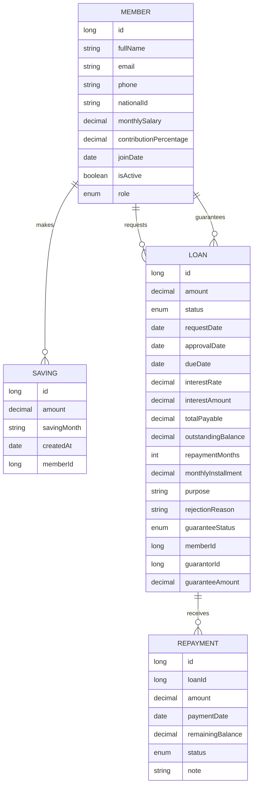

# Digital Ikimina Requirements and Conceptual Design

## 1. System Overview

Digital Ikimina is a cooperative savings and loan management platform for government workers. It helps members save monthly, request loans, use guarantors when needed, repay through salary deductions, and track cooperative finances transparently.

The system behaves like a small fintech and cooperative ERP: it manages member records, savings, loans, repayments, guarantees, financial summaries, and administrative controls.

## 2. Problem Statement

Traditional ikimina operations often depend on paper records, manual calculations, informal approvals, and delayed communication. This creates risks such as lost records, calculation mistakes, weak loan tracking, poor transparency, and misuse of cooperative funds.

Digital Ikimina solves this by digitizing records, automating financial calculations, enforcing business rules, tracking repayment status, and giving members and administrators clear visibility into cooperative activity.

## 3. Core Purpose

The purpose of the system is to provide a digital cooperative savings and loan management system for ikimina-style financial groups.

In simple terms:

> A fintech platform for managing ikimina savings, loans, guarantors, repayments, and cooperative reports digitally.

## 4. Actors

### Member

Members are cooperative participants who save, borrow, repay loans, guarantee other members, and view their financial information.

Main actions:

- Register or maintain profile information.
- Save money monthly.
- Request loans.
- Repay loans through salary deduction records.
- Act as a guarantor for another member.
- View savings, loan history, repayments, and account summary.

### Accountant

The accountant manages cooperative financial records.

Main actions:

- Record savings.
- Record salary deduction repayments.
- Verify transaction accuracy.
- Monitor outstanding loans.
- Generate financial reports.

### Loan Committee

The loan committee reviews borrowing requests.

Main actions:

- View pending loan applications.
- Check eligibility.
- Review guarantor information.
- Approve or reject loan requests.
- Provide rejection reasons.

### Secretary

The secretary manages cooperative member administration and communication.

Main actions:

- Create and update member records.
- Activate or deactivate members.
- Manage communication and notifications.
- Support reporting and member follow-up.

### Super Admin / Director General

The super admin controls the whole platform.

Main actions:

- Manage all users and roles.
- Monitor system-wide financial activity.
- Access dashboards and reports.
- Configure administrative rules and oversight.

## 5. Core Modules

1. Authentication and Access Control
2. Member Management
3. Savings Management
4. Loan Management
5. Repayment Management
6. Guarantor Management
7. Share Management
8. Reporting and Dashboard
9. Notification Management
10. Admin and Role Management

## 6. Business Rules

### Savings Rules

- Minimum monthly saving amount is 5,000 RWF.
- A member can only have one saving record for the same saving month.
- Savings increase the member's borrowing power.
- Savings are linked directly to a member account.

### Loan Eligibility Rules

- A member must be active before requesting a loan.
- A member must have joined at least 3 months before borrowing.
- Loan interest is 6%.
- A loan amount must be greater than zero.
- Repayment period must be at least 1 month.
- Monthly installment cannot exceed 60% of salary when salary is available.

### Borrowing and Guarantor Rules

- A member can borrow up to their total savings without a guarantor.
- Borrowing above total savings requires a guarantor.
- The guarantor must be active.
- The guarantor must have enough savings to cover the guarantee amount.
- A guarantee is linked to the loan request.

### Approval Rules

- New loans start as pending.
- The loan committee can approve or reject pending loans.
- Approved loans become active for repayment tracking.
- Rejected loans must include a reason when possible.
- Cancelled, repaid, rejected, or defaulted loans should not accept normal repayment activity.

### Repayment Rules

- Repayments are recorded against a loan.
- Repayments reduce the outstanding balance.
- Repayments are expected to come from salary deduction.
- When the outstanding balance reaches zero, the loan becomes repaid.

### Exit and Share Rules

- A member exits the cooperative by selling or transferring shares.
- Exiting should only be allowed after checking outstanding loans, guarantees, and unsettled obligations.
- Share movement should be auditable.

## 7. Functional Requirements

### Member Management

- The system shall allow authorized users to create members.
- The system shall store full name, email, phone, national ID, salary, contribution percentage, join date, active status, and role.
- The system shall allow authorized users to update member information.
- The system shall allow authorized users to activate or deactivate members.
- The system shall provide a member summary with savings, loans, and repayment information.

### Savings Management

- The system shall allow authorized users to record monthly savings.
- The system shall validate the minimum saving amount.
- The system shall prevent duplicate savings for the same member and month.
- The system shall calculate total savings per member.
- The system shall list saving records.

### Loan Management

- The system shall allow members to request loans.
- The system shall calculate 6% interest.
- The system shall calculate total payable amount.
- The system shall calculate monthly installments.
- The system shall check membership duration before loan creation.
- The system shall check salary repayment ability.
- The system shall require guarantor details when borrowing above savings.
- The system shall allow loan approval and rejection.
- The system shall track loan status.

### Repayment Management

- The system shall allow repayments to be recorded against active loans.
- The system shall reduce outstanding balance after each repayment.
- The system shall store payment date, amount, remaining balance, status, and note.
- The system shall mark a loan as repaid when the balance is fully settled.

### Reporting and Dashboard

- The system shall show total members.
- The system shall show active members.
- The system shall show total savings.
- The system shall show total loans.
- The system shall show pending loans.
- The system shall show outstanding loans.
- The system shall show total repayments.
- The system shall show expected interest.

### Notifications

- The system should notify members about loan decisions.
- The system should notify members about upcoming or completed deductions.
- The system should notify administrators about pending approvals.

## 8. Non-Functional Requirements

- Security: users should only access features allowed by their role.
- Reliability: financial records must remain consistent and auditable.
- Accuracy: interest, installments, balances, and totals must be calculated correctly.
- Transparency: members and administrators should be able to trace savings, loans, and repayments.
- Maintainability: business rules should be centralized in service logic where possible.
- Performance: dashboard and list screens should load quickly for normal cooperative usage.
- Responsiveness: the UI should work on desktop and mobile screens.
- Data integrity: duplicate and invalid financial records should be prevented.

## 9. Conceptual Data Model



## 10. Main Workflows

### Monthly Savings Workflow

```text
Member contributes monthly saving
-> Accountant records saving
-> System validates amount is at least 5,000 RWF
-> System checks member/month duplicate
-> System stores saving record
-> Member total savings increases
```

### Loan Request Workflow

```text
Member requests loan
-> System checks member is active
-> System checks member joined at least 3 months ago
-> System calculates interest, total payable, and monthly installment
-> System checks salary repayment limit
-> System compares loan amount with member savings
-> If loan exceeds savings, system requires guarantor
-> Loan is submitted as pending
```

### Loan Approval Workflow

```text
Loan committee reviews pending loan
-> Committee checks eligibility and guarantor details
-> If accepted, loan is approved and activated
-> If rejected, rejection reason is stored
-> Member is notified of decision
```

### Repayment Workflow

```text
Salary deduction is made
-> Accountant records repayment
-> System validates repayment amount
-> System subtracts repayment from outstanding balance
-> If balance is zero, loan becomes repaid
-> Dashboard totals are updated
```

### Member Exit Workflow

```text
Member requests exit
-> System checks outstanding loans
-> System checks active guarantees
-> System checks shares and savings position
-> Member sells or transfers shares
-> Account is closed or deactivated
```

## 11. Suggested Implementation Order

1. Confirm business rules and requirements.
2. Complete data model for missing share and notification concepts.
3. Add authentication and role-based access control.
4. Strengthen backend validation and tests for financial rules.
5. Build workflows in the frontend around real user tasks.
6. Add reporting exports and audit history.
7. Polish UI after business logic is stable.

## 12. Current Implementation Notes

The current codebase already contains core backend and frontend areas for members, savings, loans, repayments, guarantors, reports, notifications, shares, admins, and dashboard views.

The backend currently models:

- Member
- Saving
- Loan
- Repayment
- Member roles
- Loan statuses
- Repayment statuses
- Guarantee statuses

Important future gaps to confirm:

- Authentication is not yet fully represented in the domain model.
- Shares are conceptually listed but may need dedicated backend entities.
- Notifications are conceptually listed but may need persistence and delivery logic.
- Audit logs may be needed for financial transparency.
- Payroll integration may need an import/export or API workflow.
